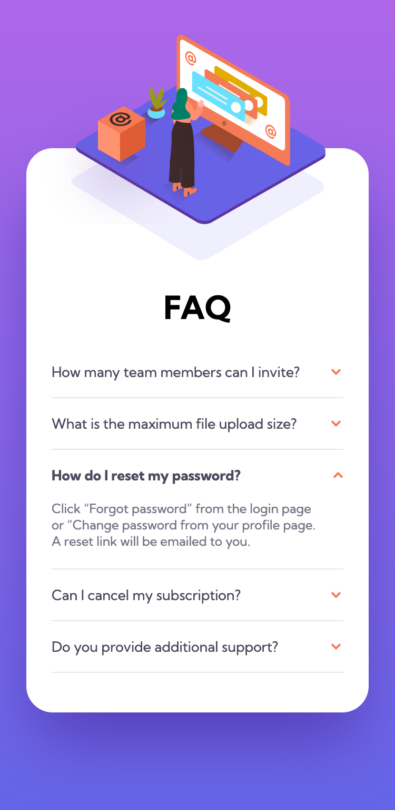

# Frontend Mentor - FAQ accordion card solution

This is a solution to the [FAQ accordion card challenge on Frontend Mentor](https://www.frontendmentor.io/challenges/faq-accordion-card-XlyjD0Oam). Frontend Mentor challenges help you improve your coding skills by building realistic projects. 

## Table of contents

- [Overview](#overview)
  - [The challenge](#the-challenge)
  - [Screenshot](#screenshot)
  - [Links](#links)
- [My process](#my-process)
  - [Built with](#built-with)
  - [What I learned](#what-i-learned)
  - [Continued development](#continued-development)
- [Author](#author)

## Overview

### The challenge

Users should be able to:

- View the optimal layout for the component depending on their device's screen size
- See hover states for all interactive elements on the page
- Hide/Show the answer to a question when the question is clicked

### Screenshot




### Links

- Solution URL: [Github](https://github.com/erelita/faq-accordion.git)
- Live Site URL: [Netlify](https://erelita.github.io/profile-card-component/)

## My process

### Built with

- Semantic HTML5 markup
- CSS custom properties
- Flexbox
- CSS Grid
- Mobile-first workflow


### What I learned

Did a lot of research for things I didn't use here. They're all complicated so I thought of just simple ways to execute everything that is needed. I'm glad that I still remember using loops and that I have done a challenge before this that used a little bit of JS.


```js
for (let i = 0; i < question.length; i++) {

    question[i].addEventListener('click', function() {
        question[i].classList.toggle('weight');
        answer[i].classList.toggle('hide');
        answer[i].classList.toggle('show');
        arrow[i].classList.toggle('rotate');

        for (let j = 0; j < question.length; j++) {
            if (question[j] != question[i] && question[j].classList.contains('weight')) {
                question[j].classList.remove('weight');
                answer[j].classList.add('hide');
                answer[j].classList.remove('show');
                arrow[j].classList.remove('rotate');
            }
        }
    });
}
```

I tried to put the arrow icon as a pseudo element of the class question, at first. 

```css
.question::after {
    position: absolute;
    background: url('../images/icon-arrow-down.svg') no-repeat;
    width: 1rem;
    height: 0.5rem;
    top: 1.75rem;
    right: 0;
}
```

But upon seeing that it needs to rotate after getting clicked, I had trouble accessing the pseudo element in JS, so I just add an arrow class using span tag inside the h2, whiche worked amazingly.

```html
<h2 class="question">
  How many team members can I invite?
  <span class="arrow"></span>
</h2>
```


### Continued development

I often see a solution that is way beyond what I can take for now and I think that's where I get stuck most of the times. But then, I kind of reset my plan and I am able to see how to solve the problem in a more simpler way.

After finishing this challenge, I am eager to learn and use more JS for the next ones.

## Author

- Github - [Erelita](https://github.com/erelita)
- Frontend Mentor - [@erelita](https://www.frontendmentor.io/profile/erelita)